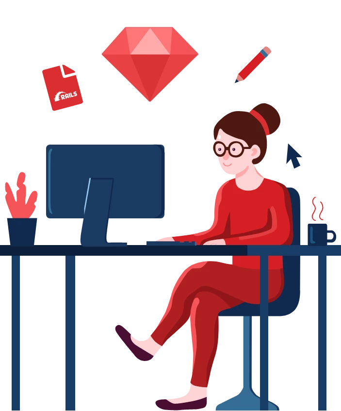

    <h1>Hello, I am <a href="#">Swe Swe Mar Soe</a> </h1>
    
      
    
🙏🏻 Welcome to my Github profile! 
        I am a <b>A Backend developer</b> 🚀 . 
        I love learning new technologies and building some projects 😍, and most of them are <b>Open source</b>. 

    

        <h2>
            What I'm up to</h2>
        <ul>
            <li> 👨🏻‍💻 I'm currently working on my Personal Blog ✍🏻</li>
            <li> 💬 Ask me about Rails , Ruby ,  PHP </li>
            <li>📫 How to reach me: 
                <a href="mailto:swesweucsy@gmail.com" target="_blank">swesweucsy@gmail.com</a></li>
            <li>👀 Take a look at <a href="https://swesweucsy.github.io" target="_blank">My Portfolio</a></li>
        </ul>
    

 
<!-- 

     

 -->
